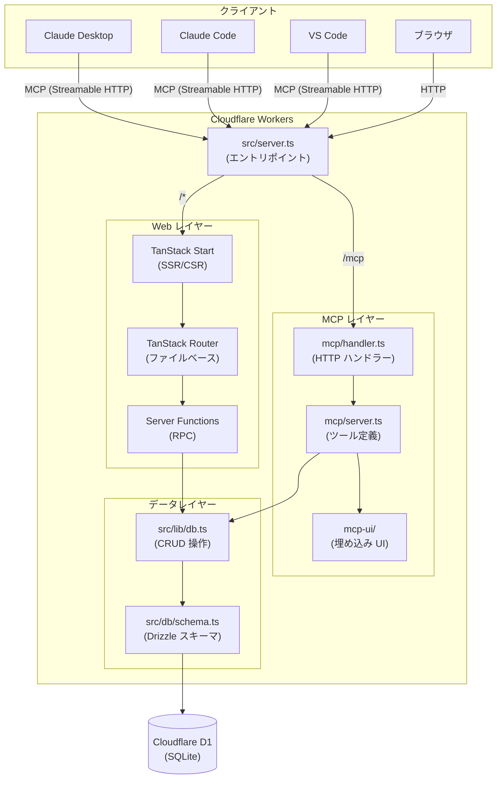
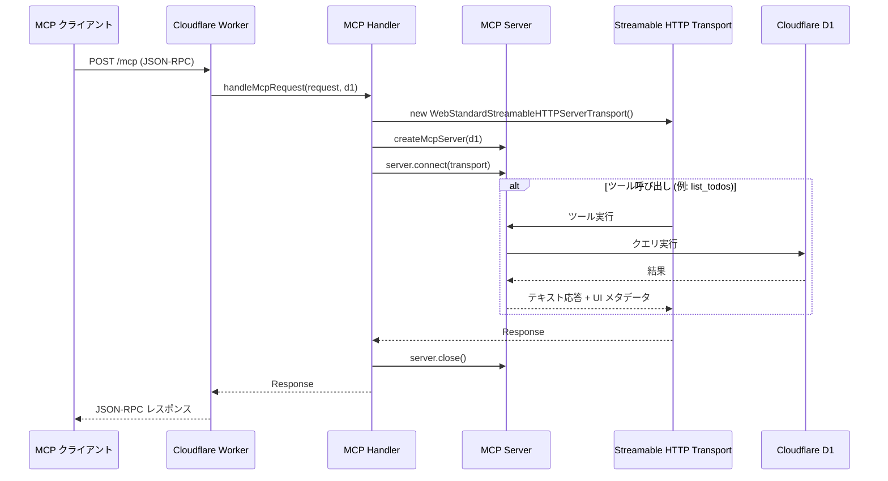
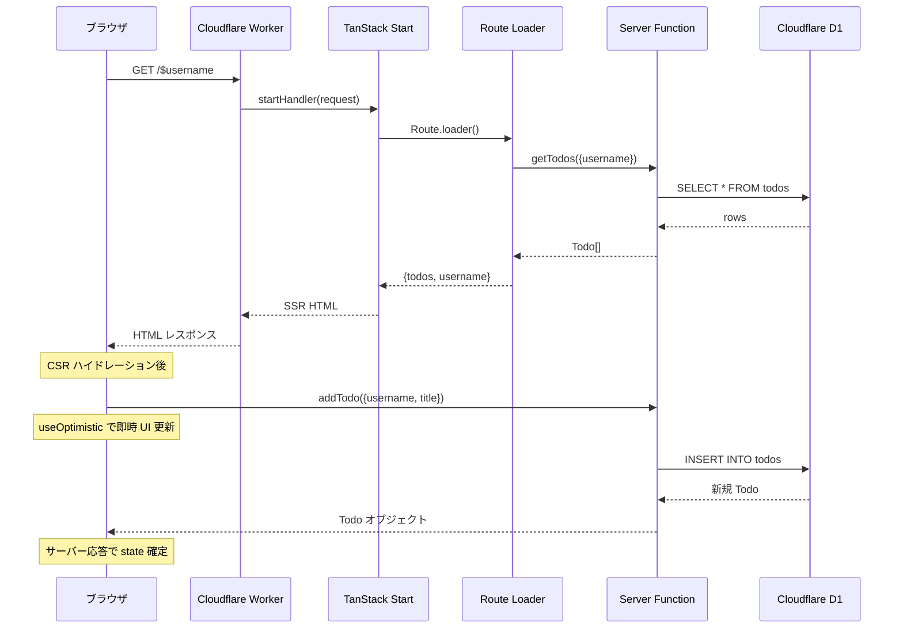
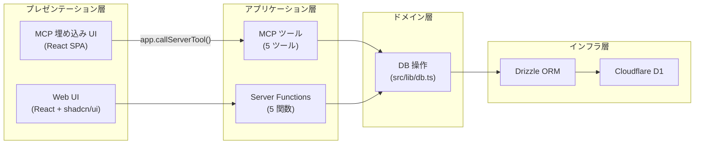
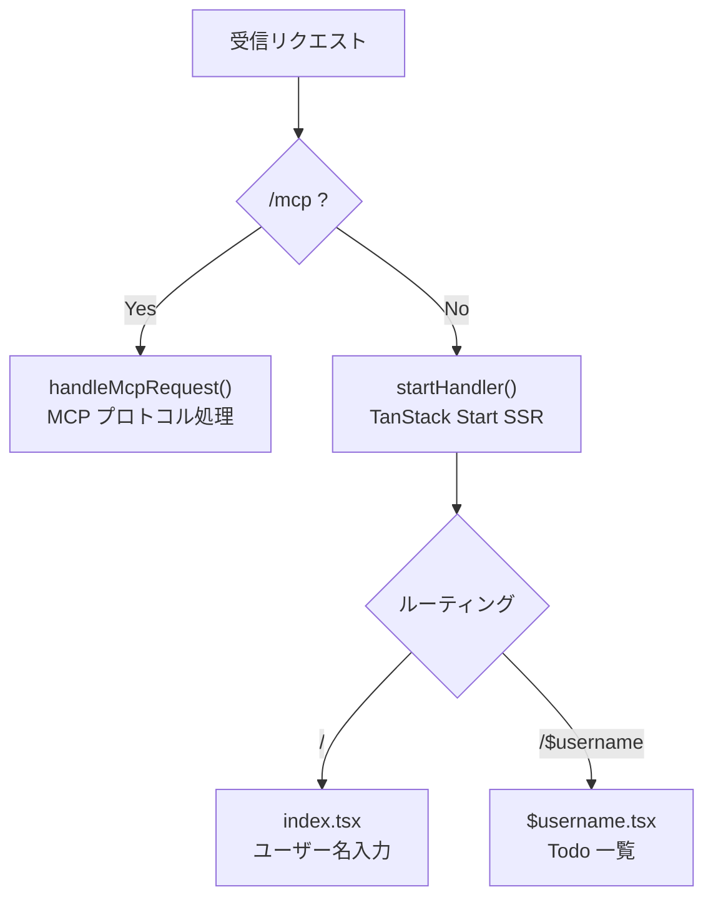
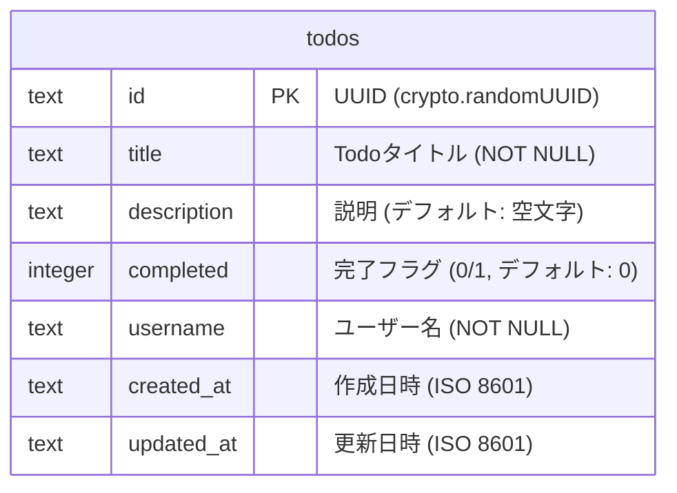
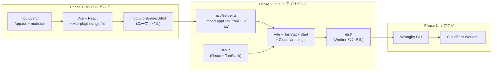

# アーキテクチャ

MCP Apps Todo の全体アーキテクチャを解説します。

## システム全体図

## リクエストフロー

### MCP リクエスト (Claude Desktop / Code / VS Code)

### Web リクエスト (ブラウザ)

## レイヤー構成

**ポイント**: MCP ツールと Web UI の Server Functions は、同じ DB 操作関数 (`src/lib/db.ts`) を共有しています。これにより、MCP 経由の操作もブラウザ経由の操作も同じデータに対して一貫した処理が行われます。

## ルーティング

Cloudflare Worker のエントリポイント (`src/server.ts`) で、パスに基づいてリクエストを振り分けます。

## データベーススキーマ

## ビルドパイプライン

**重要**: ビルドは必ず Phase 1 → Phase 2 の順で実行する必要があります。MCP UI の HTML が `?raw` インポートで MCP サーバーに埋め込まれるため、先にビルドしておく必要があります。
