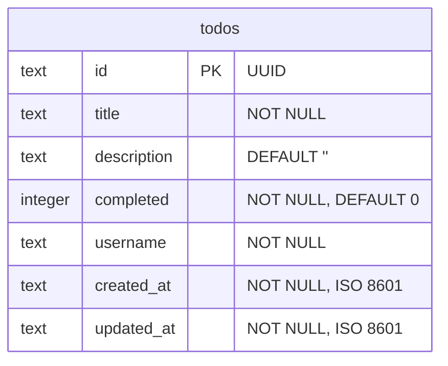
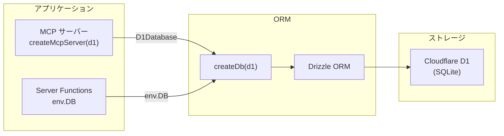

# データベース

## 概要

Cloudflare D1 (SQLite ベース) を Drizzle ORM 経由で使用しています。

## スキーマ



### カラム詳細

| カラム | 型 | 制約 | 説明 |
|--------|---|------|------|
| `id` | TEXT | PRIMARY KEY | `crypto.randomUUID()` で生成 |
| `title` | TEXT | NOT NULL | Todo のタイトル |
| `description` | TEXT | DEFAULT `''` | Todo の説明 (オプション) |
| `completed` | INTEGER | NOT NULL, DEFAULT `0` | 完了フラグ (0=未完了, 1=完了) |
| `username` | TEXT | NOT NULL | ユーザー名 (認証なし、任意の文字列) |
| `created_at` | TEXT | NOT NULL | 作成日時 (ISO 8601 形式) |
| `updated_at` | TEXT | NOT NULL | 更新日時 (ISO 8601 形式) |

### Drizzle ORM 定義 (`src/db/schema.ts`)

```typescript
export const todos = sqliteTable("todos", {
  id: text("id").primaryKey(),
  title: text("title").notNull(),
  description: text("description").default(""),
  completed: integer("completed", { mode: "boolean" }).notNull().default(false),
  username: text("username").notNull(),
  createdAt: text("created_at").notNull().$defaultFn(() => new Date().toISOString()),
  updatedAt: text("updated_at").notNull().$defaultFn(() => new Date().toISOString()),
});
```

`mode: "boolean"` により、SQLite の INTEGER (0/1) を TypeScript の `boolean` として扱えます。

## DB 操作関数 (`src/lib/db.ts`)

### getTodos

ユーザーの Todo 一覧を取得します。`status` によるフィルタリングが可能です。

```
getTodos(db, username, status?) → Todo[]
```

- `status: "all"` (デフォルト) — 全件
- `status: "active"` — 未完了のみ
- `status: "completed"` — 完了済みのみ
- 作成日時の降順でソート

### addTodo

新しい Todo を追加します。

```
addTodo(db, username, title, description?) → Todo
```

- ID は `crypto.randomUUID()` で生成
- `description` 省略時は空文字
- `created_at`, `updated_at` は現在時刻

### updateTodo

既存の Todo のタイトルや説明を更新します。

```
updateTodo(db, id, username, {title?, description?}) → Todo | undefined
```

- `id` と `username` の両方が一致するレコードのみ更新
- `updated_at` を現在時刻に更新
- 該当レコードがない場合は `undefined`

### toggleTodo

Todo の完了/未完了を切り替えます。

```
toggleTodo(db, id, username) → Todo | null
```

- 現在の `completed` の反転値をセット
- 2段階のクエリ: SELECT で現在値を取得 → UPDATE で反転値をセット
- 該当レコードがない場合は `null`

### deleteTodo

Todo を削除します。

```
deleteTodo(db, id, username) → Todo | undefined
```

- `id` と `username` の両方が一致するレコードを削除
- `.returning()` で削除されたレコードを返却

## DB 初期化 (`src/db/index.ts`)

```typescript
export function createDb(d1: D1Database) {
  return drizzle(d1, { schema });
}
```

Cloudflare D1 のバインディング (`D1Database`) を受け取り、Drizzle ORM インスタンスを生成します。

## マイグレーション

Drizzle Kit でマイグレーションを管理しています。

```bash
# マイグレーションファイル生成
bunx drizzle-kit generate

# ローカル DB に適用
bunx wrangler d1 migrations apply mcp-todo-db --local

# 本番 DB に適用
bunx wrangler d1 migrations apply mcp-todo-db --remote
```

マイグレーションファイルは `drizzle/` ディレクトリに格納されます。

## 接続構成



- MCP サーバーは `handleMcpRequest()` の引数として `d1` を受け取る
- Server Functions は `env.DB` (Cloudflare Workers の環境バインディング) から取得
- いずれも同じ `createDb()` を通じて Drizzle インスタンスを生成
