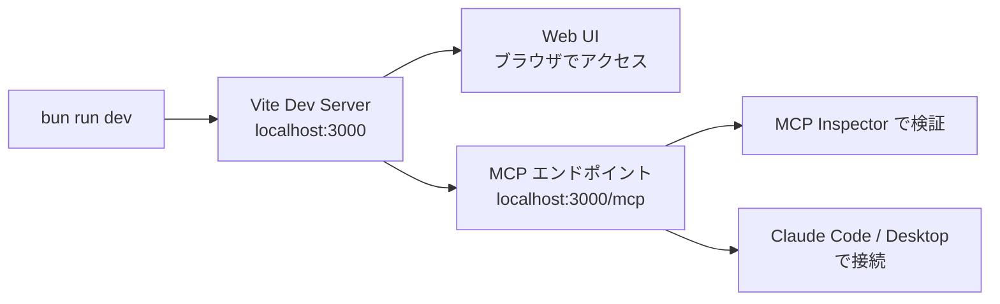

# 開発ガイド

## 前提条件

- [Bun](https://bun.sh/) — パッケージマネージャー・ランタイム
- [Wrangler CLI](https://developers.cloudflare.com/workers/wrangler/) — Cloudflare Workers 開発ツール
- Cloudflare アカウント (デプロイ時)

## セットアップ

```bash
# リポジトリのクローン
git clone <repository-url>
cd mcp-apps-todo

# 依存関係のインストール
bun install

# ローカル DB にマイグレーション適用
bunx wrangler d1 migrations apply mcp-todo-db --local

# 開発サーバー起動
bun run dev
```

開発サーバーは `http://localhost:3000` で起動します。

## スクリプト一覧

| コマンド | 説明 |
|---------|------|
| `bun run dev` | 開発サーバー起動 (localhost:3000, HMR 有効) |
| `bun run build:mcp-ui` | MCP 埋め込み UI のビルド |
| `bun run build` | MCP UI + メインアプリのフルビルド |
| `bun run preview` | ビルド後のプレビュー |
| `bun run deploy` | ビルド + Cloudflare Workers へデプロイ |
| `bun run test` | テスト実行 (Vitest) |
| `bun run cf-typegen` | Cloudflare バインディングの型生成 |

## ローカル開発の流れ



### Web UI の確認

ブラウザで `http://localhost:3000` にアクセスすると Web UI が表示されます。

### MCP サーバーの検証

```bash
# MCP Inspector でツールのテスト
npx @modelcontextprotocol/inspector http://localhost:3000/mcp
```

### Claude Code からの接続

```bash
# MCP サーバーとして登録
claude mcp add todo --transport http http://localhost:3000/mcp
```

## デプロイ

### 初回セットアップ

```bash
# 1. Cloudflare D1 データベースの作成
bunx wrangler d1 create mcp-todo-db

# 2. wrangler.jsonc の database_id を更新
#    作成時に表示された ID に置き換える

# 3. 本番 DB にマイグレーション適用
bunx wrangler d1 migrations apply mcp-todo-db --remote

# 4. デプロイ
bun run deploy
```

### 通常のデプロイ

```bash
bun run deploy
```

これは内部的に以下を実行します:

1. `bun run build:mcp-ui` — MCP UI の単一 HTML ビルド
2. `vite build` — メインアプリのビルド (MCP UI HTML を埋め込み)
3. `wrangler deploy` — Cloudflare Workers にデプロイ

## DB マイグレーション

### 新しいマイグレーションの作成

```bash
# 1. src/db/schema.ts を編集

# 2. マイグレーションファイルを生成
bunx drizzle-kit generate

# 3. ローカル DB に適用
bunx wrangler d1 migrations apply mcp-todo-db --local

# 4. 本番 DB に適用
bunx wrangler d1 migrations apply mcp-todo-db --remote
```

## MCP UI の開発

MCP 埋め込み UI (`mcp-ui/`) は独立したビルド対象です。

```bash
# MCP UI のみビルド
bun run build:mcp-ui
```

MCP UI を変更した場合:

1. `mcp-ui/src/App.tsx` を編集
2. `bun run build:mcp-ui` で再ビルド
3. 開発サーバーを再起動 (メインビルドが `?raw` で HTML を読み込むため)

## コンポーネントの追加 (shadcn/ui)

```bash
# shadcn/ui コンポーネントの追加
bunx shadcn@latest add <component-name>
```

設定は `components.json` に記載されています。コンポーネントは `src/components/ui/` に配置されます。

## 環境変数

### Cloudflare Workers バインディング

| バインディング | 型 | 説明 |
|-------------|---|------|
| `DB` | `D1Database` | Cloudflare D1 データベース |

バインディングは `wrangler.jsonc` で設定し、`env.DB` でアクセスします。

### ローカル開発

ローカル開発では Wrangler がローカル D1 (SQLite ファイル) を自動提供します。特別な環境変数の設定は不要です。
