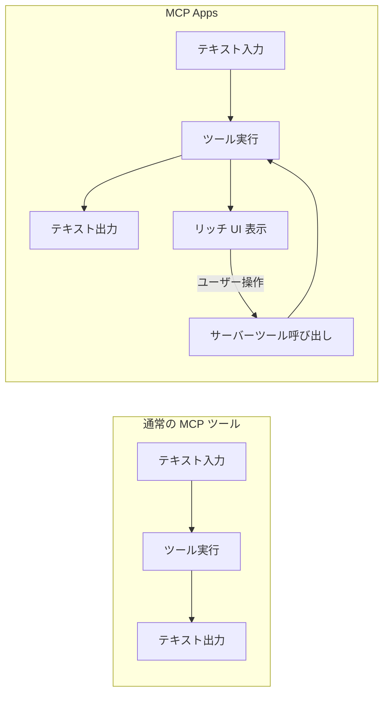
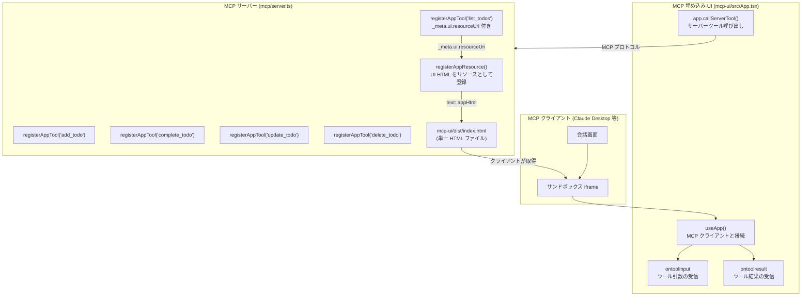
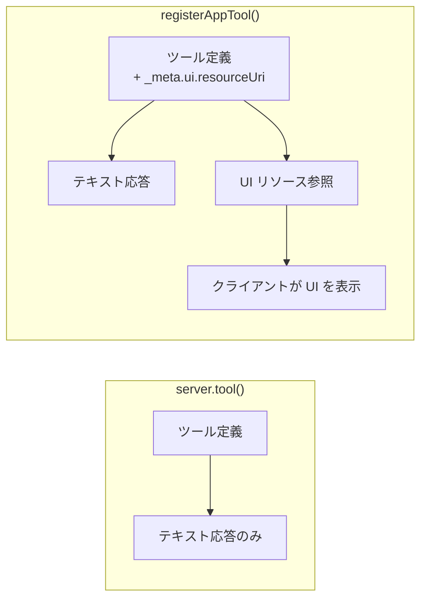
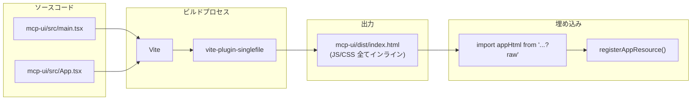
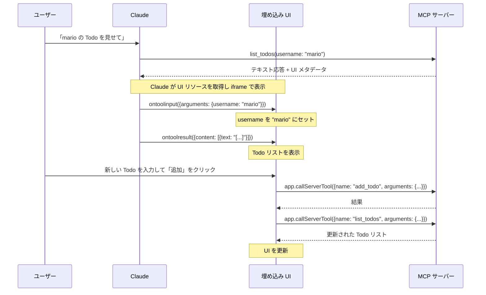
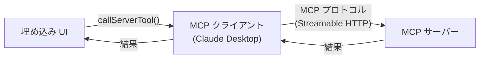
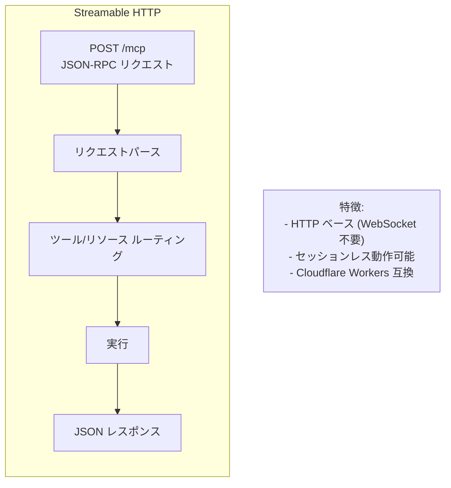
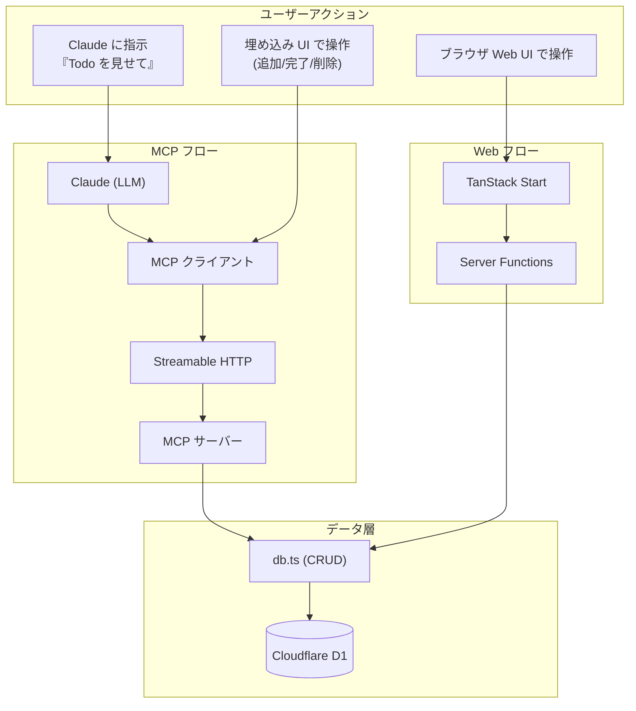

# MCP Apps の仕組み

このドキュメントでは、MCP Apps がどのように実現されているかを詳細に解説します。

## MCP Apps とは

MCP (Model Context Protocol) は、LLM がツールやリソースにアクセスするための標準プロトコルです。通常の MCP ツールはテキストの入出力のみですが、**MCP Apps** 拡張を使うと、ツール実行時に**インタラクティブな HTML UI を MCP クライアントの会話内に埋め込む**ことができます。



## 主要パッケージ

本プロジェクトで使用している MCP Apps 関連のパッケージは以下の2つです。

| パッケージ | 役割 | 使用箇所 |
|-----------|------|---------|
| `@modelcontextprotocol/sdk` | MCP サーバー本体 | `mcp/server.ts`, `mcp/handler.ts` |
| `@modelcontextprotocol/ext-apps` | MCP Apps 拡張 (UI 埋め込み) | `mcp/server.ts` (サーバー側), `mcp-ui/src/App.tsx` (UI 側) |

`@modelcontextprotocol/ext-apps` は以下の2つのサブパスを提供しています。

- **`/server`** — サーバー側: `registerAppTool`, `registerAppResource`, `RESOURCE_MIME_TYPE`
- **`/react-with-deps`** — UI 側: `useApp`, `useHostStyles`, `useDocumentTheme`

## 実装の全体像



## サーバー側の実装詳細

### 1. UI リソースの登録

MCP Apps では、まず埋め込む UI の HTML を **MCP リソース** として登録します。

```typescript
// mcp/server.ts
import appHtml from "../mcp-ui/dist/index.html?raw";  // Vite の ?raw で文字列として取得

const UI_RESOURCE_URI = "ui://todo/app.html";

registerAppResource(
  server,
  "Todo App UI",           // リソース名
  UI_RESOURCE_URI,         // リソース URI
  { description: "Interactive Todo list application" },
  async () => ({
    contents: [{
      uri: UI_RESOURCE_URI,
      mimeType: RESOURCE_MIME_TYPE,  // MCP Apps 専用 MIME タイプ
      text: appHtml,                 // 単一 HTML 文字列
    }],
  })
);
```

**ポイント**:
- `?raw` サフィックスにより、Vite がファイルを文字列としてインポート
- `RESOURCE_MIME_TYPE` は `@modelcontextprotocol/ext-apps` が提供する MCP Apps 用の MIME タイプ
- UI は単一 HTML にバンドルされている (CSS, JS 全てインライン)

### 2. App Tool の登録

通常の MCP ツールの代わりに `registerAppTool()` を使うことで、UI メタデータ付きのツールを登録します。

```typescript
registerAppTool(
  server,
  "list_todos",                    // ツール名
  {
    title: "Todo一覧取得",
    description: "指定ユーザーのTodo一覧を取得します",
    inputSchema: {                 // Zod スキーマ
      username: z.string().describe("ユーザー名"),
      status: z.enum(["all", "active", "completed"]).optional(),
    },
    _meta: {
      ui: { resourceUri: UI_RESOURCE_URI },  // ← UI リソースへの参照
    },
  },
  async ({ username, status }) => {
    const todos = await dbOps.getTodos(db, username, status ?? "all");
    return {
      content: [{ type: "text", text: JSON.stringify(todos, null, 2) }],
    };
  }
);
```

**`_meta.ui.resourceUri`** がキーとなるプロパティです。MCP クライアントはこのフィールドを見て、ツール実行時に対応する UI リソースを取得・表示します。

### 3. registerAppTool vs server.tool



`registerAppTool()` は内部的に `server.tool()` をラップし、`_meta` に UI メタデータを追加しています。テキスト応答は通常通り返されるため、MCP Apps 非対応のクライアントでもテキストとして結果を受け取れます。

## UI 側 (mcp-ui) の実装詳細

### ビルドと埋め込み



`vite-plugin-singlefile` により、React アプリの JS と CSS が全てインラインで1つの HTML ファイルにバンドルされます。これにより、外部リソースへの依存なく MCP リソースとして配信できます。

### useApp() フック

`@modelcontextprotocol/ext-apps/react-with-deps` が提供する `useApp()` フックが、MCP クライアントとの通信を担います。

```typescript
const { app, isConnected } = useApp({
  appInfo: { name: "TodoApp", version: "1.0.0" },
  capabilities: { tools: { callChanged: true } },
  onAppCreated: (app) => {
    // ツール入力時のコールバック
    app.ontoolinput = (params) => {
      const args = params.arguments ?? {};
      if (args.username) setUsername(args.username);
    };

    // ツール結果受信時のコールバック
    app.ontoolresult = (params) => {
      if (params.isError) return;
      // JSON 配列なら Todo リストとして解釈
      const data = JSON.parse(textContent.text);
      if (Array.isArray(data)) setTodos(data);
    };
  },
});
```

### イベントフロー



### app.callServerTool()

埋め込み UI からサーバー側の MCP ツールを直接呼び出せます。

```typescript
// Todo の追加
const result = await app.callServerTool({
  name: "add_todo",
  arguments: { username, title: newTitle.trim() },
});

// Todo の完了トグル
await app.callServerTool({
  name: "complete_todo",
  arguments: { id, username },
});

// Todo の削除
await app.callServerTool({
  name: "delete_todo",
  arguments: { id, username },
});
```

この呼び出しは MCP クライアント (Claude Desktop 等) を経由して MCP サーバーに送られます。UI は直接サーバーと通信するのではなく、MCP プロトコルのチャネルを通じて間接的に通信します。



### テーマ対応

MCP Apps はホスト (Claude Desktop 等) のテーマに追従するための仕組みを提供しています。

```typescript
useHostStyles(app, app?.getHostContext());  // ホストのスタイルを適用
const theme = useDocumentTheme();           // "dark" | "light"
const isDark = theme === "dark";
```

## HTTP トランスポート

### セッションレス設計

MCP サーバーはリクエストごとにインスタンスを生成・破棄するセッションレス設計です。

```typescript
// mcp/handler.ts
export async function handleMcpRequest(request: Request, d1: D1Database) {
  const transport = new WebStandardStreamableHTTPServerTransport({
    sessionIdGenerator: undefined,    // セッション管理なし
    enableJsonResponse: true,         // JSON レスポンス有効
  });

  const server = createMcpServer(d1);
  await server.connect(transport);

  try {
    return await transport.handleRequest(request);
  } finally {
    await server.close();             // リクエスト完了後にクローズ
  }
}
```

**`sessionIdGenerator: undefined`** により、セッション ID を生成せずステートレスに動作します。Cloudflare Workers のようなサーバーレス環境に適した設計です。

### Streamable HTTP トランスポート



通常の MCP トランスポートとして SSE (Server-Sent Events) や stdio がありますが、本プロジェクトでは **Streamable HTTP** を使用しています。これは HTTP POST リクエストでやり取りするシンプルなトランスポートで、以下の利点があります:

- WebSocket やロングポーリングが不要
- Cloudflare Workers (サーバーレス) で動作可能
- `enableJsonResponse: true` で SSE ではなく JSON で返す

## 全体のデータフロー



## まとめ

MCP Apps の実現に必要な要素は以下の3つです:

1. **UI リソース** — `registerAppResource()` で単一 HTML を登録
2. **App Tool** — `registerAppTool()` で `_meta.ui.resourceUri` 付きツールを登録
3. **埋め込み UI** — `useApp()` フックで MCP クライアントと通信し、`callServerTool()` でサーバーツールを呼び出す

この3つが連携することで、Claude の会話画面内にインタラクティブな Todo 管理 UI が表示され、ユーザーはテキスト指示と GUI 操作の両方で Todo を管理できるようになります。
