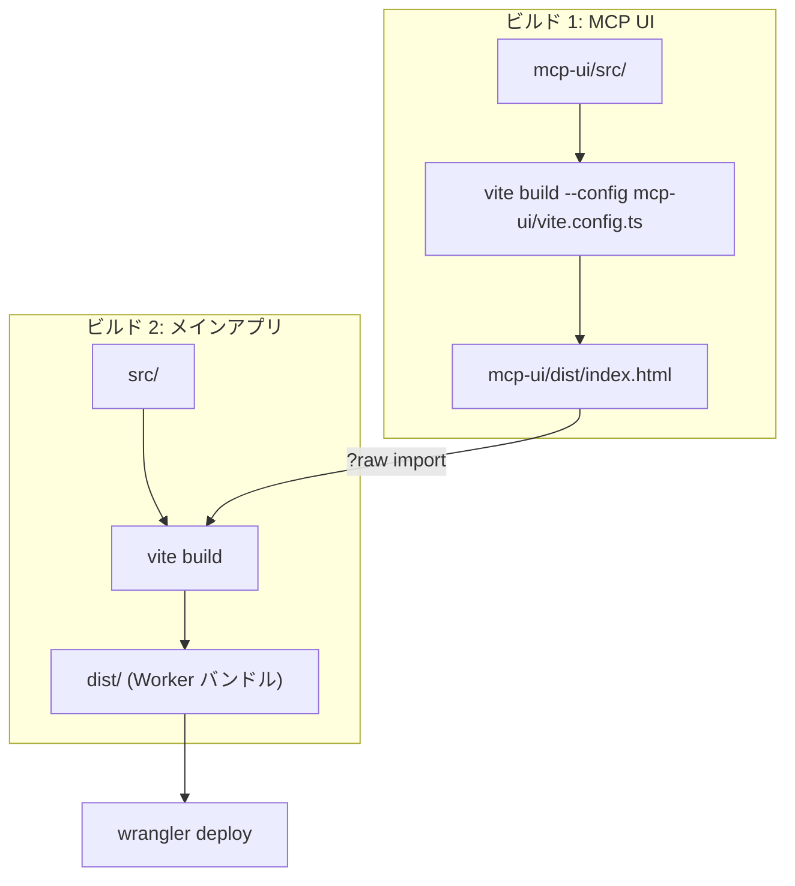

# プロジェクト構成

## ディレクトリツリー

```
mcp-apps-todo/
├── mcp/                          # MCP サーバー実装
│   ├── server.ts                 #   ツール・リソース定義
│   └── handler.ts                #   HTTP リクエストハンドラー
│
├── mcp-ui/                       # MCP 埋め込み UI (別ビルド)
│   ├── src/
│   │   ├── App.tsx               #   Todo UI コンポーネント
│   │   └── main.tsx              #   エントリポイント
│   ├── vite.config.ts            #   単一 HTML ビルド設定
│   └── dist/
│       └── index.html            #   ビルド済み単一 HTML
│
├── src/                          # メイン Web アプリケーション
│   ├── server.ts                 #   Cloudflare Worker エントリポイント
│   ├── router.tsx                #   TanStack Router 設定
│   │
│   ├── routes/                   #   ファイルベースルーティング
│   │   ├── __root.tsx            #     ルートレイアウト
│   │   ├── index.tsx             #     / (ユーザー名入力画面)
│   │   └── $username.tsx         #     /$username (Todo 一覧)
│   │
│   ├── components/               #   React コンポーネント
│   │   ├── TodoList.tsx          #     Todo リスト (メイン)
│   │   ├── TodoItem.tsx          #     個別 Todo アイテム
│   │   ├── AddTodo.tsx           #     Todo 追加フォーム
│   │   ├── Header.tsx            #     ナビゲーションヘッダー
│   │   └── ui/                   #     shadcn/ui コンポーネント群
│   │
│   ├── lib/                      #   ライブラリ・ユーティリティ
│   │   ├── db.ts                 #     DB 操作関数 (CRUD)
│   │   ├── server-fns.ts         #     TanStack Server Functions
│   │   └── utils.ts              #     ユーティリティ (cn 等)
│   │
│   ├── db/                       #   データベース
│   │   ├── schema.ts             #     Drizzle ORM スキーマ
│   │   └── index.ts              #     DB 初期化
│   │
│   └── hooks/                    #   カスタムフック
│       └── use-mobile.ts         #     モバイル判定
│
├── drizzle/                      # DB マイグレーション
│   ├── 0000_unusual_legion.sql   #   初期スキーマ
│   └── meta/
│       └── _journal.json         #   マイグレーション履歴
│
├── public/                       # 静的アセット
│
├── package.json                  # 依存関係・スクリプト
├── tsconfig.json                 # TypeScript 設定
├── vite.config.ts                # メインビルド設定
├── wrangler.jsonc                # Cloudflare Workers 設定
├── drizzle.config.ts             # Drizzle ORM 設定
├── components.json               # shadcn/ui 設定
├── CLAUDE.md                     # Claude Code 用プロジェクト情報
└── README.md                     # プロジェクト概要
```

## 主要ファイルの役割

### エントリポイント

| ファイル | 役割 |
|---------|------|
| `src/server.ts` | Cloudflare Worker のエントリポイント。`/mcp` と Web UI のルーティングを行う |
| `mcp-ui/src/main.tsx` | MCP 埋め込み UI のエントリポイント |

### MCP サーバー (`mcp/`)

| ファイル | 役割 |
|---------|------|
| `mcp/server.ts` | MCP サーバーの作成。5つのツールと1つの UI リソースを登録 |
| `mcp/handler.ts` | HTTP リクエストを Streamable HTTP トランスポートで処理 |

### データベース

| ファイル | 役割 |
|---------|------|
| `src/db/schema.ts` | `todos` テーブルの Drizzle ORM スキーマ定義。`Todo` / `NewTodo` 型のエクスポート |
| `src/db/index.ts` | `createDb()` 関数。D1 バインディングから Drizzle インスタンスを生成 |
| `src/lib/db.ts` | CRUD 操作 (getTodos, addTodo, updateTodo, toggleTodo, deleteTodo) |

### Web UI

| ファイル | 役割 |
|---------|------|
| `src/lib/server-fns.ts` | TanStack Start の `createServerFn()` による型安全な RPC。DB 操作関数をラップ |
| `src/routes/$username.tsx` | Todo ページ。`loader` で初期データを取得し、`TodoList` コンポーネントを描画 |
| `src/components/TodoList.tsx` | メインコンポーネント。`useOptimistic` によるオプティミスティック更新 |
| `src/components/TodoItem.tsx` | 個別 Todo の表示・編集・削除 |
| `src/components/AddTodo.tsx` | Todo 追加フォーム |

### ビルド設定

| ファイル | 役割 |
|---------|------|
| `vite.config.ts` | メインアプリのビルド設定。TanStack Start + Cloudflare + Tailwind |
| `mcp-ui/vite.config.ts` | MCP UI のビルド設定。`vite-plugin-singlefile` で単一 HTML 出力 |
| `wrangler.jsonc` | Cloudflare Workers 設定。D1 バインディング、カスタムドメイン |
| `drizzle.config.ts` | Drizzle ORM のマイグレーション設定 |

## 2つのビルド対象

このプロジェクトには独立した2つのビルド対象があります。



| | MCP UI | メインアプリ |
|---|--------|-------------|
| ソース | `mcp-ui/src/` | `src/` |
| 設定 | `mcp-ui/vite.config.ts` | `vite.config.ts` |
| 出力 | 単一 HTML ファイル | Cloudflare Worker バンドル |
| 目的 | MCP クライアント内の埋め込み UI | ブラウザ向け Web アプリ + MCP サーバー |
| フレームワーク | React (素の) | React + TanStack Start |
| スタイリング | インラインスタイル | Tailwind CSS + shadcn/ui |

## パスエイリアス

`tsconfig.json` で `@/*` が `./src/*` にマッピングされています。

```typescript
import { todos } from "@/db/schema";     // → src/db/schema.ts
import * as dbOps from "@/lib/db";        // → src/lib/db.ts
import { TodoList } from "@/components/TodoList";  // → src/components/TodoList.tsx
```
