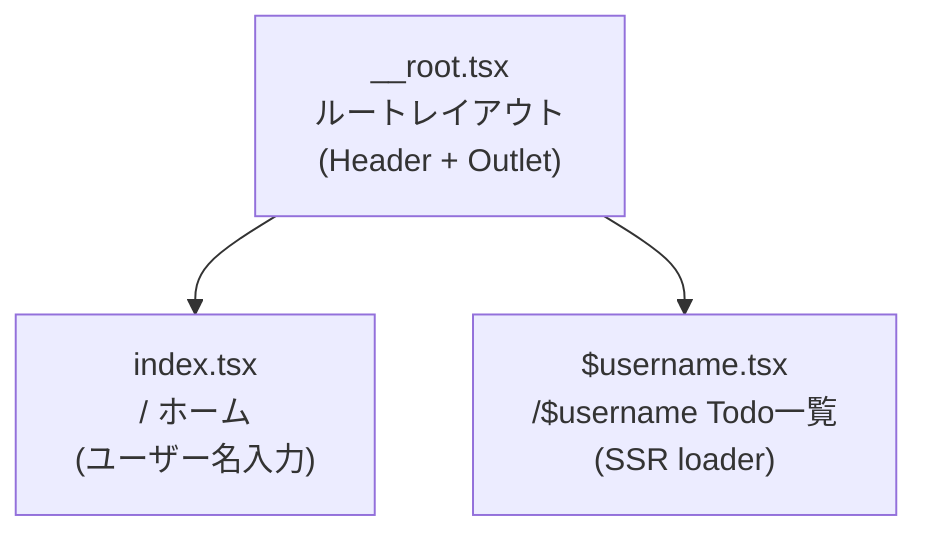
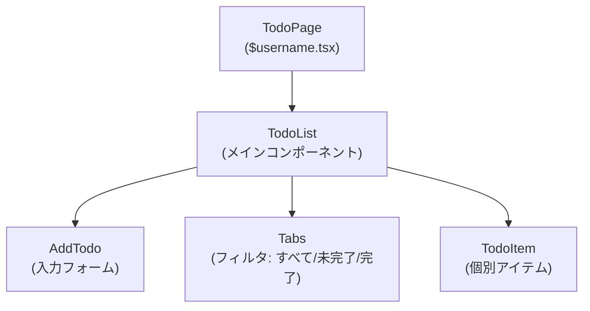
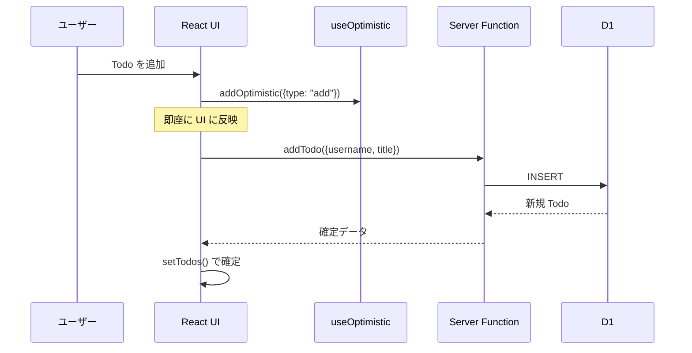
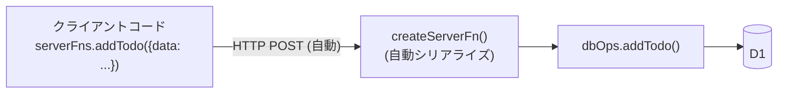

# Web UI

ブラウザからアクセスできる Web UI の構成を説明します。

## 概要

Web UI は React 19 + TanStack Start による SSR/CSR アプリケーションです。MCP 経由の操作と同じデータベースを共有しており、どちらの UI からでも同じ Todo を操作できます。

## 技術構成

| 要素 | 技術 |
|------|------|
| フレームワーク | TanStack Start (TanStack Router ベースのメタフレームワーク) |
| UI ライブラリ | shadcn/ui (Radix UI ベース) |
| スタイリング | Tailwind CSS v4 |
| サーバー通信 | TanStack Server Functions (型安全な RPC) |
| 状態管理 | React useState + useOptimistic |

## ページ構成

### `/` — ホーム画面 (`src/routes/index.tsx`)

ユーザー名を入力するフォーム。入力後に `/$username` にナビゲートします。

### `/$username` — Todo 一覧 (`src/routes/$username.tsx`)

- **Route Loader** でサーバーサイドデータフェッチ
- `getTodos` Server Function を呼び出し、初期データを取得
- `TodoList` コンポーネントに渡して描画

## コンポーネント構成

### TodoList (`src/components/TodoList.tsx`)

メインコンポーネント。以下の機能を持ちます:

- **フィルタリング**: すべて / 未完了 / 完了 の Tab 切り替え
- **オプティミスティック更新**: `useOptimistic` フックにより、サーバー応答を待たずに即座に UI を更新
- **CRUD 操作**: Server Functions を通じた追加・完了トグル・更新・削除

### オプティミスティック更新パターン

`useOptimistic` は以下の4つのアクションを処理します:

| アクション | 説明 |
|-----------|------|
| `add` | 仮 ID でリスト先頭に追加 |
| `toggle` | completed フラグの反転 |
| `update` | タイトルの即時変更 |
| `delete` | リストからの即時除去 |

## Server Functions (`src/lib/server-fns.ts`)

TanStack Start の `createServerFn()` により、型安全なサーバー呼び出しを実現しています。

| 関数 | HTTP メソッド | 用途 |
|------|-------------|------|
| `getTodos` | GET | Todo 一覧取得 |
| `addTodo` | POST | Todo 追加 |
| `updateTodo` | POST | Todo 更新 |
| `toggleTodo` | POST | 完了トグル |
| `deleteTodo` | POST | Todo 削除 |

Server Functions のメリット:
- API エンドポイントの手動定義が不要
- 型安全 (入力・出力とも TypeScript の型が適用)
- クライアントからは通常の関数呼び出しと同じインターフェース
